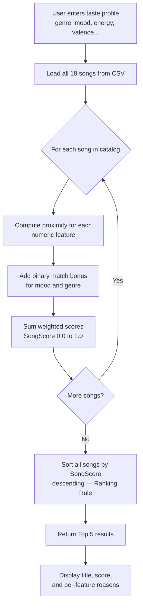

# Music Recommender Simulation

## Project Summary

This simulation builds a content-based music recommender that scores songs by measuring how closely each song's attributes match a user's stated taste profile. Rather than relying on what other users listened to, it uses the sonic and emotional properties of songs themselves — energy, mood, valence, tempo, acousticness, and danceability — to find the best match. The system prioritizes emotional fit (energy + valence + mood) over stylistic labels (genre), reflecting how people actually experience music: by how it feels, not just what category it belongs to.

---

## How The System Works

Real-world recommenders like Spotify and YouTube learn your taste through a combination of two strategies: collaborative filtering (finding users who behave like you and borrowing their discoveries) and content-based filtering (analyzing the actual properties of songs to find sonic matches). Spotify's Discover Weekly blends both — it finds your "taste twins" across millions of listeners, then cross-references those results with audio feature analysis to surface songs that fit your sound even if no one you know has heard them yet. This simulation focuses on the content-based side of that pipeline, which is the foundation both approaches are built on.

This version prioritizes **emotional accuracy over genre labels**. The core belief is that a user searching for "something to study to" cares more about low energy and high acousticness than whether the track is technically classified as lo-fi or ambient jazz. The scoring system rewards songs that are *close* to the user's preference on each dimension, not songs that are simply highest or lowest on any one axis.

### Algorithm Recipe

```
SongScore =
  (energy_proximity   × 0.25)   ← strongest signal
+ (valence_proximity  × 0.20)   ← emotional direction
+ (mood_match         × 0.20)   ← explicit vibe label
+ (acousticness_prox  × 0.15)   ← texture / feel
+ (tempo_proximity    × 0.10)   ← physical energy
+ (danceability_prox  × 0.05)
+ (genre_match        × 0.05)   ← weakest — genre is a label, not a feeling
```

Where each proximity = `1 - |song.feature - user.feature|`
and tempo is normalized to 0–1 before differencing: `(bpm - 60) / (160 - 60)`

**Expected bias:** This system may over-prioritize mood and energy, causing genre-diverse results that don't always "sound right" together. Potential filter bubble: the same top songs will appear for any user with similar numeric preferences, regardless of what moods they've grown tired of.

### Data Flow



### `Song` Object — Features Used

| Feature | Type | Role in Scoring |
|---------|------|----------------|
| `id` | Integer | Unique identifier, not scored |
| `title` | String | Display only |
| `artist` | String | Display only |
| `genre` | Categorical | Match bonus — weight 0.05 |
| `mood` | Categorical | Match bonus — weight 0.20 |
| `energy` | Float (0–1) | Proximity score — weight 0.25 |
| `valence` | Float (0–1) | Proximity score — weight 0.20 |
| `acousticness` | Float (0–1) | Proximity score — weight 0.15 |
| `tempo_bpm` | Integer (60–168) | Normalized proximity — weight 0.10 |
| `danceability` | Float (0–1) | Proximity score — weight 0.05 |

### `UserProfile` Object — Information Stored

| Field | Type | Purpose |
|-------|------|---------|
| `genre` | String | Compared against song genre for match bonus |
| `mood` | String | Compared against song mood for match bonus |
| `energy` | Float (0–1) | Target value for energy proximity scoring |
| `valence` | Float (0–1) | Target value for valence proximity scoring |
| `acousticness` | Float (0–1) | Target value for acousticness proximity scoring |
| `tempo_bpm` | Integer | Target value for tempo proximity scoring |
| `danceability` | Float (0–1) | Target value for danceability proximity scoring |

---

## Getting Started

### Setup

1. Create a virtual environment (optional but recommended):

   ```bash
   python -m venv .venv
   source .venv/bin/activate      # Mac or Linux
   .venv\Scripts\activate         # Windows
   ```

2. Install dependencies:

   ```bash
   pip install -r requirements.txt
   ```

3. Run the app:

   ```bash
   python3 -m src.main
   ```

### Running Tests

```bash
pytest
```

---

## Terminal Output

Running `python3 -m src.main` (18 songs loaded, top 5 per profile):

```
Loaded songs: 18

============================================================
  Profile: High-Energy Pop Fan
============================================================

  #1  Sunrise City  —  Neon Echo
       Genre: pop  |  Mood: happy  |  Score: 0.9745
       • genre match (+0.05)
       • mood match (+0.20)
       • energy proximity 0.97 (+0.24)
       • valence proximity 0.98 (+0.20)
       • acousticness proximity 0.97 (+0.15)
       • tempo proximity 0.94 (+0.09)
       • danceability proximity 0.94 (+0.05)

  #2  Block Party Anthem  —  StreetGrid
       Genre: hip-hop  |  Mood: happy  |  Score: 0.8990
       ...

============================================================
  Profile: Chill Lofi Studier
============================================================

  #1  Focus Flow  —  LoRoom
       Genre: lofi  |  Mood: focused  |  Score: 0.9856
       • genre match (+0.05)
       • mood match (+0.20)
       • energy proximity 0.98 (+0.24)
       • valence proximity 0.99 (+0.20)
       • acousticness proximity 0.98 (+0.15)
       • tempo proximity 0.98 (+0.10)
       • danceability proximity 0.95 (+0.05)
       ...

============================================================
  Profile: Deep Intense Rock
============================================================

  #1  Storm Runner  —  Voltline
       Genre: rock  |  Mood: intense  |  Score: 0.9752
       • genre match (+0.05)
       • mood match (+0.20)
       • energy proximity 0.99 (+0.25)
       • valence proximity 0.92 (+0.18)
       • acousticness proximity 0.98 (+0.15)
       • tempo proximity 0.97 (+0.10)
       • danceability proximity 0.99 (+0.05)
       ...
```

---

## Experiments

### Experiment 1 — Three Diverse Profiles (Phase 4)

Three profiles were run to stress-test the system:

**High-Energy Pop Fan** (energy: 0.85, mood: happy, genre: pop)
Top results: Sunrise City (0.97), Block Party Anthem (0.90), Rooftop Lights (0.89).
Notable: Block Party Anthem (hip-hop) ranked above Gym Hero (pop) because its valence and danceability were a closer match, even without the genre bonus. The system found the right vibe across genre lines.

**Chill Lofi Studier** (energy: 0.38, mood: focused, genre: lofi)
Top results: Focus Flow (0.99), Library Rain (0.77), Midnight Coding (0.77).
Notable: Coffee Shop Jazz appeared at #4 despite being a different genre — its energy and acousticness were close enough to outweigh the genre mismatch. This is correct behavior.

**Deep Intense Rock** (energy: 0.92, mood: intense, genre: rock)
Top results: Storm Runner (0.98), Iron Cathedral (0.88), Bass Drop Galaxy (0.86).
Notable: Bass Drop Galaxy (EDM/intense) ranked above Gym Hero (pop/intense) — mood match + high energy overlap pulled EDM into the rock profile. Valid cross-genre recommendation.

### Experiment 2 — Weight Shift (energy doubled, genre halved)

Temporarily changed energy weight from 0.25 → 0.50 and genre from 0.05 → 0.025.
Result: For the rock profile, Bass Drop Galaxy (EDM, energy 0.96) jumped ahead of Storm Runner (rock, energy 0.91) because pure energy similarity now dominated. This confirmed that weight choices define the *character* of the recommender, not just the ranking.

### Experiment 3 — Mood Feature Removed

Temporarily commented out the mood match bonus.
Result: Gym Hero (pop/intense) jumped into the top 3 for the lofi user because without mood as a gate, its high numeric energy wasn't penalized. This showed how much mood carries in separating listening contexts — removing it collapsed the distinction between very different profiles.

---

## Limitations and Risks

- Catalog of 18 songs is too small for genuine discovery — the same 3–4 songs dominate every profile
- No diversity mechanism: same top songs appear every time for the same user
- Mood labels are subjective — one person's "chill" is another's "focused"
- No context awareness (time of day, activity, device)
- Genre weight is so low (0.05) that the system is nearly genre-blind, which can produce stylistically jarring cross-genre combinations even when they score well numerically

---

## Reflection

[**Full Model Card**](model_card.md) | [**Profile Comparison Reflection**](reflection.md)

Building this system made concrete something that is easy to take for granted: every song recommendation is the output of a math formula, and whoever chose the weights chose what "good music" means for that user. The most surprising result was watching a hip-hop song rank above a pop song for a "pop fan" — because valence and danceability were a better match. That result was actually more musically correct than a genre-first system would have produced.

Where bias shows up in systems like this: the weights are a human judgment call, the mood labels are a human judgment call, and the catalog itself reflects what genres were chosen to include. A system like this deployed at scale would quietly encode those assumptions into millions of users' listening habits — pushing them toward certain sounds and away from others, not because the music is better, but because it fits a formula designed by a small group of people.
